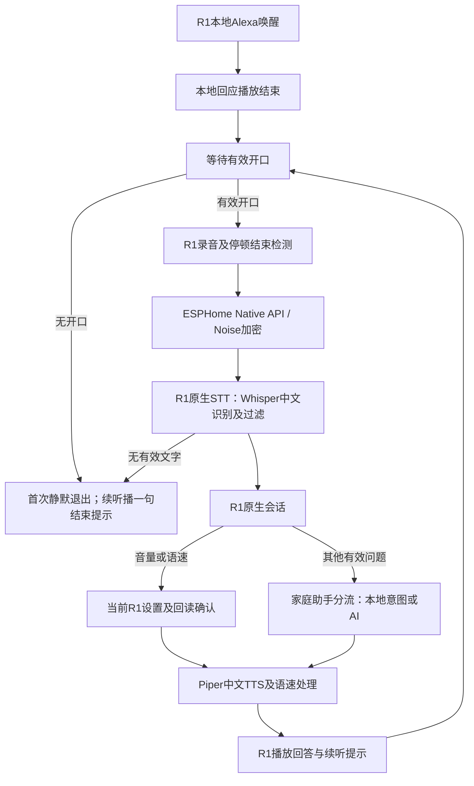

> 历史记录：本文版本、命令及“下一步”反映记录当时状态；当前排期以[根 README](../README.md)为准。原始产物迁移见[归档说明](../test-results/README.md)，原验收结论不变。

# R1 v53：独立等待时间、自然接话与中文语音配置

## 当前版本与验收边界

当前已部署Android v53、HA组件0.6.0。用户于本轮暂停真人测试，待回来后继续；即时开口、最终版静默及真人语速/等待时间指令不能标为实机验收通过。此前真人25%音量指令通过；中途的漏检和静默提前结束均保留在下方及证据目录。

### 两个等待配置

| 配置 | 默认 | 范围 | 适用场景 |
| --- | --- | --- | --- |
| 首次唤醒等待开口时间 | 10秒 | 1～120秒，步长1秒 | 每次Alexa唤醒后的首次开口 |
| 持续对话等待开口时间 | 15秒 | 1～120秒，步长1秒 | 每次回答及续听提示后的再次开口 |
| 讲话结束停顿时间 | 1.8秒 | 0.2～10秒，步长0.1秒 | 已确认有效人声后的连续停顿 |

HA设备页面配置并同步到R1私有存储，所有等待计时、有效起音判断、停顿计时和结束收音决定均在R1执行。每轮使用配置快照，新设置只影响下一轮。HA原生STT不运行外部VAD分段，按R1的结束标志结束输入。

原“等待开口时间”的实体ID及协议键保持，用HA显示名称明确为“首次唤醒等待开口时间”；新加独立续听数值实体。首次升级将旧默认20秒迁移为10秒，并设续听15秒；旧的非20秒自定义值保留为首次等待值。后续启动不重复覆盖用户设置。

### 推荐的等待时间语音命令

| 用途 | 可以直接说 |
| --- | --- |
| 设置首次等待 | “唤醒后等我二十秒”“把首次唤醒等待开口时间设为10秒”“第一次唤醒后等待时间改成十五秒”“叫醒后等待开口二十秒” |
| 设置续听等待 | “持续对话时等我三十秒”“把续听等待时间改成15秒”“连续对话等待开口时间调到二十秒”“继续对话的时候等我30秒” |
| 延长或缩短 | “首次等待时间长一点”“唤醒后多等我五秒”“续听等待时间缩短五秒”“持续对话等待时间短一点” |
| 查询 | “唤醒后会等我多久”“首次等待时间是多少”“持续对话的等待时间是多少秒” |
| 恢复默认 | “恢复首次等待时间默认值”“恢复续听等待时间默认值”“续听等待时间恢复默认” |

“长一点/短一点”每次加减5秒；同一连续会话中紧接着可说“再长一点/再短一点”。范围之外不假报成功，查询不修改设置。仅说“等待时间调到20秒”会要求明确首次还是续听，不猜测。支持中文/阿拉伯数字及“请”“帮我”“把R1的”等常见前缀，实际麦克风识别效果待真人验收。

### 回应结束即可接话

不要求用户额外等待或估计1秒。R1在本地回应/续听提示播放前启动并读取麦克风，播放期间持续读取并丢弃；播放完成时保留跨越完成边界的第一段录音，直接移交命令收音。取消原先回应后的200ms休眠及此时才打开AudioRecord的过程。语音期间不上传提示音，主音频格式不变；此改动涉及真实录放并行，必须在R1上另行验证后才能宣称体验完成。

## 变更与边界

本轮修复用户报告的v47交互问题，保留API22、PCM S16LE/16kHz/单声道/20ms、Noise认证及原厂包隐藏隔离。不更换Alexa模型，不开展KWS专项测试。

- 音量从15档硬件百分比改为0～100整数逻辑百分比，步长1；HA Number指定`display_precision=0`和`%`单位。媒体播放器协议仍使用0～1，面向用户显示百分比。
- R1所有本地提示（MediaPlayer）和HA回答（AudioTrack）使用同一逻辑增益；播放前先设置软件增益，再设置固定硬件最大档，不能先全音量开播。初始化从旧媒体音量迁移，正常原生连接关闭时恢复近似硬件档位。百分比是设置值，不是主观响度或声压百分比。
- 语速沿用0.5～1.5倍、0.05步长。语音控制支持百分比及倍数，确认回复采用新语速；HA会提前准备TTS，因此按请求Context、设备、卫星和会话引擎匹配当前管线，在返回确认前更新其语速缓存参数，不修改其他管线。本地提示资源与Piper/FFmpeg变速路径保持一致。
- “助手2”“唤醒词2”“讲话完毕检测”改为禁用，普通配置区不显示；高级实体管理仍可以找到禁用记录，便于回退。没有改成“已隐藏”等文字。
- HA2026.8.2设备注册表按集成分别归属设备；旧代码使用`add_config_entry_id`和DeviceInfo不能合并设备，反而产生关联的未命名记录。新代码不再注册桥接DeviceInfo，将音箱实体关联原ESPHome设备；只移除本集成拥有、无名称/实体/子设备/其他归属的确定孤立记录。

## 日常指令

| 功能 | 示例 | 规则 |
| --- | --- | --- |
| 精确音量 | 音量调到35%；把声音调到百分之四十五 | 整数百分比，成功回读才确认 |
| 音量降低 | 音量小一点；声音小一点；小声一点；调低音量 | 减10个百分点 |
| 音量提高 | 音量大一点；声音大一点；大声一点；调高音量 | 加10个百分点 |
| 精确语速 | 语速调到80%；语速设为零点八倍 | 80%=0.8倍 |
| 放慢 | 语速慢一点；说慢一点；说话慢一点；慢点说 | 减0.05倍 |
| 加快 | 语速快一点；说快一点；说话快一点；快点说 | 加0.05倍 |
| 正常语速 | 正常语速；恢复正常语速 | 1.0倍 |
| 查询 | 现在音量是多少；现在语速是多少 | 播报实际设置 |
| 结束 | 结束对话；取消本次对话；不用回答了 | 退出续听 |

支持中文数字、阿拉伯数字、常见标点和礼貌前缀。相对指令到边界会说明已达上下限；绝对值越界提示范围，非语速档位采用最近档位并说明。查询不会执行写入。

成功调节后60秒内、同一连续会话支持“再小一点”“再慢一点”等承接；其他有效话题、失败、明确结束或重新Alexa唤醒清除承接状态。新加只读诊断实体“唤醒会话序号”用于把本地唤醒边界传给HA，不改变协议消息编号或KWS模型。“调到80%”没有明确上下文时要求说明目标，不猜测设备或参数。

控制只作用于发起请求的R1。浏览器文本测试没有R1设备身份时不会执行音箱设置；不要因此给AI开放全屋设备控制权限。

## 无输入与端点

原来80ms VAD连续阳性就进入命令窗口，噪声/启动瞬态可能使20秒等待被1.8秒停顿替代。当前原生入口联合WebRTC VAD、去直流后的音频能量（至少24 PCM RMS）及背景能量（至少两倍）：300ms内累计200ms普通人声，或连续120ms强人声才确认起音，保留300ms起音缓冲。仅供VAD判断的副本做4倍饱和放大，原始音频用于能量比较、KWS和上传。背景估计仅在非命令阶段且VAD阴性时更新；旧WebSocket的80ms规则保持。

HA原生STT额外统计音频AC能量，正常EOF但有效能量不足80ms时返回无文字，避免Whisper对零音频或直流信号的虚构结果进入意图。原生入口过滤仅Alexa及历史明确误写；通用过滤入口行为不变，简短回答和正常重复命令不按文本长度一刀切。

首次未开口按等待开口期限静默返回；续听未开口仅播放现有一句结束提示，不调用对话。有效开口后，结束停顿和命令上限以先到者为准；每轮使用独立配置快照。

诊断只保留窗口来源/编号、起音时间、人声时长、输入字节、结束原因及能量统计，不保存家庭录音或识别正文。管理员可用以下命令绕过KWS进入一次真实收音窗口，来源标为`local_admin_diagnostic`，这不是Alexa真人唤醒验收：

```sh
python3 tools/native/manage-r1-native.py diagnostic-window 192.0.2.10:5555
python3 tools/native/manage-r1-native.py diagnostic-window 192.0.2.10:5555 --followup
```

HA的`stt-no-text-recognized`表示未得到可提交的文字，既可能是正常静默过滤，也可能是有效讲话识别失败。不能删除错误信息掩盖后者。新增限时15分钟的脱敏诊断由显式配置管理员验证操作启动，仅输出阶段、引擎、错误代码和文字长度，不输出识别正文或TTS URL/token。

## HA配置与整个链路

R1设备位于“设置 → 设备与服务 → ESPHome → R1原生语音”。主助手明确选择“R1原生中文助手”，主唤醒词选择Alexa。首次等待10秒、续听等待15秒、结束停顿1.8秒、命令上限30秒为默认；迁移规则见上方，两项等待均可分别调整。

| 助手 | 识别 | 对话 | 语音输出 | 用途 |
| --- | --- | --- | --- | --- |
| 中文语音助手（纯本地） | 原Whisper | Home Assistant本地意图 | 原Piper | 本地使用和排障参照 |
| 中文语音助手（本地＋AI） | 原Whisper | 家庭助手自动分流 | 原Piper | 保持全局默认；通用入口 |
| R1原生中文助手 | R1原生语音识别 | R1原生会话 | R1中文回应 | 本R1专用入口 |

三者是平行可选的管线，R1不会按顺序调用三条管线。R1专用会话的普通问题会委托同一个家庭助手分流服务，按其配置处理本地意图或AI问题。“原生”指传输和R1适配方式，不表示所有问答都在R1本地计算。

R1管线的实体ID：

- STT：`stt.r1_yuan_sheng_yu_yin_shi_bie`，底层使用`stt.faster_whisper`，中文。
- 会话：`conversation.r1_yuan_sheng_hui_hua`，专用控制后委托`conversation.jia_ting_ai_lu_you`。
- TTS：`tts.r1_zhong_wen_hui_ying`，复用Piper的`zh_CN-huayan-medium`，按设备语速变速。

服务器唤醒词保持空，Alexa由R1本地检测。通用“语音识别（Whisper＋无效输入过滤）”当前没有被这三条管线选择，是备用入口；不要把它误选为R1原生STT，否则端点控制行为不同。



ESPHome是实际R1的连接和音频传输入口；R1专用集成提供STT、会话、音量适配和变速，两者服务同一台物理设备。“音箱”媒体播放器目前只支持音量设置/增减，不意味着音乐播放功能已交付。

## 验证与回退

本轮证据目录：`test-results/2026-09-06-r1-sample01-interaction-fixes/`。最终测试与部署结果见该目录及README；合成、固定文本、管理员收音窗口和真人语音分别记录，不互相替代。

执行命令：

```sh
JAVA_HOME=/home/developer/.sdkman/candidates/java/17.0.19-tem ANDROID_SDK_ROOT=/home/developer/.local/share/android-sdk android/r1-probe/gradlew -p android/r1-probe --no-daemon testDebugUnitTest lintDebug assembleDebug
docker run --rm --network none --entrypoint python -e PYTHONPATH=/work/integrations/home_assistant -v /path/to/phicomm-r1-satellite:/work:ro ghcr.io/home-assistant/home-assistant:2026.8.2 -m unittest discover -s /work/tools/ha/tests -p 'test_*.py' -v
docker run --rm --network none --entrypoint python -e PYTHONPATH=/work/integrations/home_assistant -v /path/to/phicomm-r1-satellite:/work:ro ghcr.io/home-assistant/home-assistant:2026.8.2 /work/tools/ha/tests/check_guard_setup.py
python3 tools/native/deploy-r1-native.py install 192.0.2.10:5555 --evidence test-results/2026-09-06-r1-sample01-interaction-fixes
python3 tools/native/pair-home-assistant.py --verify-interaction 02:00:00:00:00:01
```

验证操作临时调节音量和语速后恢复原值，会重启HA；不是日常使用入口。配置私有备份位于HA `/config/r1_component_backups/interaction-fixes-config-20260906/`；组件备份位置由`ha-deployment.log`记录。原APK保存在本轮`previous-satellite.apk`，哈希在`deployment-baseline.json`。

回退顺序：停止原生服务（恢复近似硬件媒体音量）→恢复v47 APK与组件→通过正常注册表API恢复本轮禁用项及旧显示精度→HA配置检查及重启→显式恢复原生监听。保留原配对和原厂包隐藏状态；不直接覆盖在线HA的`.storage`。整套回退是否实测须单独记录。


### 已完成的实机与主机检查

- Android122项单元测试、lint和APK构建通过；HA39项单元/管线测试、配置生命周期及部署工具测试通过。
- 20个本地管理员发起的真实麦克风静默窗口通过：首次10轮、续听10轮。均等待20秒，上传字节0、STT结果0、HA管线请求0；初次窗口含唤醒提示约22～23秒，续听窗口含前后提示约26～27秒。该检查绕过KWS，未模拟真人完整问答后的声学环境，不等于真人连续对话验收。
- HA/R1实际回读0%、35%、45%、100%通过；8条固定文本音量/语速指令通过。纯文本经真实服务改变设备设置，不是麦克风指令验收。
- 主助手及Alexa保留，三个禁用项无运行状态，设备注册表仅保留原ESPHome物理设备；前端官方数字格式函数对整数步长状态输出0%、35%、45%、100%，未取得浏览器截图，视觉确认单独记录。
- R1重启后配置和音频隔离状态保留、音频帧持续增长，开机38.66秒时确认恢复。第一轮检查工具的5秒ADB连接超时单独记录，未把它误判为设备重启失败或删掉失败记录。


### 真人测试暴露的修正

首轮用户确认说了“音量调到30%”，但v48未确认起音、未发起HA请求。此前20轮静默测试通过不能证明正常讲话可用。回查2026-09-03T044732已验收的原始录音统计，人声RMS约53.88、静音约14.63；v48的固定100 RMS门槛过高。v49将绝对下限改为24，仍要求背景两倍能量和120ms连续VAD阳性；HA的能量检查同步修正，并新增低电平语音回归。旧失败与v48静默结果保留，不用旧版本静默结果代替v49实机验证。


### 用户确认的端点职责（2026-09-06）

等待开口和讲话完毕检测是每轮收音的两个独立阶段，首次Alexa唤醒与每次续听均如此。两项数值配置由HA管理并同步到R1私有持久配置，所有倒计时和状态切换在R1执行。没有有效开口时只计等待期限；确认有效人声后停止等待计时，转为讲话结束停顿计时，每次继续讲话重置停顿。HA原生STT的`requires_external_vad=false`使其不再分段收音，HA只消费R1的音频结束标志。

实际卫星测试还发现HA基础实体在启动管线时无条件解析旧VAD下拉实体，即使STT不使用它。禁用下拉项后原解析器会抛出“VAD sensitivity entity not found”，导致R1上传却没有HA STT事件。0.5.1按固定HA版本在该卫星实例上适配兼容解析器，不改HA Core、不启用HA端点计时；卸载恢复原方法。新增使用实际HA卫星基类的回归测试。该故障及修正不改变R1端两阶段职责。


### v49真人结果与v50候选起音

用户确认实际说“25%”，R1完成真实STT→专用控制→TTS并设置25%，该项通过。之后用户确认没有说话，但9.38秒时的140ms弱声音触发起音，约1.94秒后结束并收到无文字结果；没有额外AI回答，但未等满20秒，故续听静默判定失败。

v50在R1增加候选起音阶段：最近300ms内至少200ms有效人声，或连续120ms清晰强人声（RMS至少48且为背景4倍）才确认开口。短暂弱声音不启动HA请求、不切换停顿计时；较弱正常讲话允许短间隙，清晰短回答保留快速路径。起音300ms环形缓冲与两阶段时间配置不变。新增重现140ms弱突发、正常低电平讲话、清晰短答及10秒后开口的端侧测试。

软件百分比与旧Android15档不是相同的响度曲线；初始化保留的是设置百分比，先设置软件增益是为避免播放启动时的瞬时全音量，不宣称新旧相同百分比的主观响度完全一致。


### v50漏检与v51 VAD输入修正

用户确认完整说了“语速调到百分之八十”，v50却等待20秒后退出，未启动STT，语速仍0.9，记录为失败。新增同一固定libfvad提交的主机回放：既有静音样本在1/4/8/16倍VAD输入下均没有达到候选起音条件；既有人声样本VAD检测时长从1倍的6020ms增加到4倍的6620ms，选择最小改善档4倍。回放只输出统计，不复制或上传原音频。

v51仅将供VAD判断的PCM副本做4倍饱和放大，原始音频仍用于能量/背景比较、KWS及上传；播放音量与用户两阶段时间设置不变。新增前8秒每100ms的数值起音追踪（时间、RMS峰值、VAD/普通/强人声帧数），不保存可还原音频。该变更的真人效果须以v51实测为准。


### v53最终自动检查与交付

Android130项测试、lint及构建通过；HA45项测试与配置生命周期通过。真实HA/R1回读确认两项默认10/15秒，分别写23/27秒成功，14条固定文本控制（含6条等待配置）通过后恢复10/15秒；音量25%、语速90%保留。两项显示名称已在注册表核对，原三个旧配置保持禁用，实际设备仍唯一。

固定合成中文语音经Whisper→R1会话→设备音量→TTS完整通过，没有STT错误；它不是麦克风验收。现装APK与构建SHA256一致，状态listening、last_error=null。用户已明确暂停真人测试，未运行最终版主动提示/麦克风验收；v53的录放并行、立即接话、静默及真人语速/等待时间配置保持待验证。

最终证据：`summary.json`、`ha-v53-live-verification.json`、`ha-v53-entities.json`、`v53-runtime.json`、`android-v53-build.log`、`ha-v53-tests.log`。用户返回后按提示结束立即说话测试，不再要求额外等待1秒；先确认“语速调到百分之八十”，再测“语速慢一点”、两项等待配置、两种无输入窗口及正常短回答。
